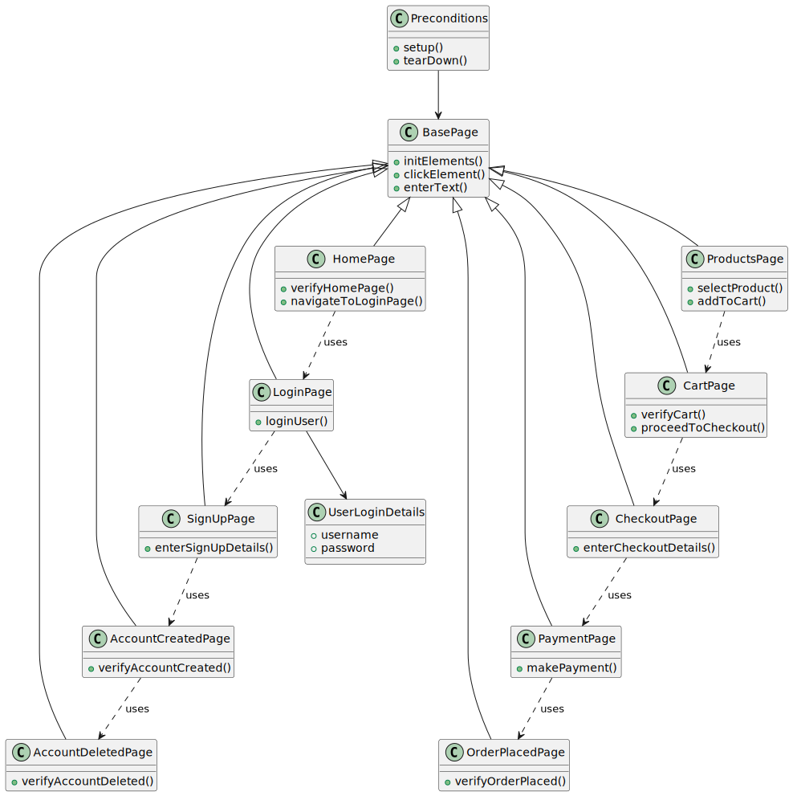

[](https://www.plantuml.com/plantuml/uml/TPJHhX8n48Rl-nJhdSRiUG1ZJa0WUa6KwF80atPO6xejQRiWKTvT2pjbi8NB-JlVDrlQpa847yV1Y3SATzfYytsrwEPVFwzNZJGGWX3tmYS8k84Ucz-Y-VTxhwsEAuC3sXZUlhlLfD5oFnMfXZQYx_1NAbmuy8iR7e17z7ftfYgrMpZg7Y9sRkrwRQVe8l8u7_-qRMPnVbvF0fCAsu2-0iYBHHxhvUMLCJuqOy30-JzqRxU7BA1FlPMN646RK9fOcyZqvAAWBjjufqOP0zS5D2ZZbD1-WLATMu2F5JM7S7XQNluJgKhKWtSICP5_ejoxiKOdYY0DVHabjUyYNh6D53pVIDugI95yFAdk9Pm7j0_A0VOubKiJRn349XaFAwvlNg7V692eoXrcOMdzlrMGYCGyhyldKhhHneL7Y3K_pwiZb031JcaQeg9uEiSI3TRdu7bjZX8WIZ6VXwjgbmcbiqf7xMoutwOu7kYyHmI_T2TxdULnUTk-vhUGGzF3ShtGquabxXZGMnXmkaWGmibv9Ixtsv-GHRkOeLNfQVuB)

# Automation Framework

This repository contains an automation framework designed to test a web application using the Page Object Model (POM)
design pattern. The framework is implemented in Java and utilizes Selenium for browser automation, with Google Guice for
dependency injection.

## Project Structure

- **src/main/java/com/automation/ui/pages**: Contains page classes representing different pages of the web application.
  Each class encapsulates the elements and actions that can be performed on a particular page.
- **src/main/java/com/automation/ui/service**: Provides utility classes and services used across the application.
- **src/test/java/com/automation/ui/regression**: Contains test cases that extend the base test class (`BaseTest`) to
  ensure consistent setup and teardown.

## Key Features

- **Page Object Model (POM)**: Each page of the web application is represented by a class, encapsulating the web
  elements and actions associated with that page.
- **Dependency Injection**: The framework uses Google Guice to manage dependencies, ensuring modularity and testability.
- **Reusable Components**: The design promotes reusability, making the test code easier to maintain and extend.
- **TestNG** : Tests use TestNG for orchestrating and running tests suites

## Usage

1. **Setup**: There's no extra setup needed, just build the project with maven and all the dependencies will be
   downloaded
2. **Writing Tests**: Create test classes by extending `BaseTest`. Use the page object classes to interact with the web
   application.
3. **Running Tests**: Select the preferred TestNG xml from the resources directory and run

